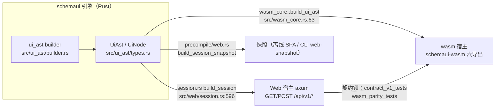
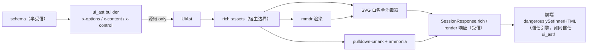
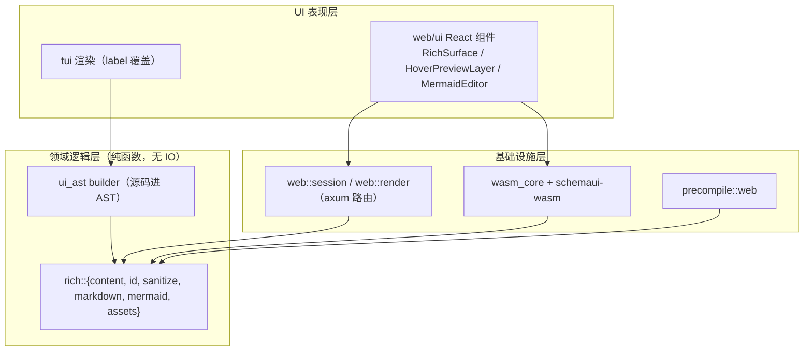

# Mermaid / SVG / Markdown 富内容 — v1 设计

> 状态：**已实现**（2026-09-23，PR-1/2/3
> 全部落地；实现与本文的偏差见文末"实现备注"）
> 关联：[#192](https://github.com/YuniqueUnic/schemaui/issues/192)、[#193](https://github.com/YuniqueUnic/schemaui/issues/193)
> 本文档取代并修正上述两个 issue
> 中的方案细节；分歧点见[附录 A](#14-附录-a对-192193-的逐条修正)。

---

## 1. 背景

schemaui 把 JSON Schema 变成 Web / TUI 交互编辑器，也是 AI agent 的结构化问答
UI（a2ui-ask）。它的三宿主纪律是产品核心约束：**同一份引擎代码跑在 native HTTP
服务（axum）、浏览器 wasm（Playground）、edge Worker
三个宿主上**，自定义前端只需实现最小 API 契约。

当前的表单表达能力只有纯文本：字段标题、描述是裸字符串，枚举选项是平行数组（`enum_options`
标签 + `enum_values` 值），连 per-option 的 label/description 都无法表达。而
schema 的典型生产者恰恰是 AI agent——agent
想问"三个候选架构选哪个"时，最有信息量的选项载体是**一张图**，不是一行文字。issue
#192/#193 提出引入 Mermaid 渲染与富内容，方向正确，但其方案在依赖事实、API
约定、宿主覆盖三处与代码库现实不符（详见附录 A），需要一份修正后的完整设计。

## 2. 需求

### 2.1 问题陈述

1. **表达缺口**：schema 作者/agent
   无法在表单中放图——选项不能带图、字段说明不能带图、描述不能有格式。
2. **编辑缺口**：用户正在编辑的值本身就是 Mermaid 源码时（agent
   让你修改配置文件里的 pipeline 图），没有实时预览。
3. **契约缺口**：任何渲染能力必须对自定义前端保持"最小契约"——前端拿到结果就能显示，不应被要求打包
   mermaid.js 这类渲染库。

### 2.2 目标场景（成功标准）

- a2ui-ask 生成的表单里，`select`/`radio` 的每个选项带一张 Mermaid
  缩略图，悬停放大（不溢出视口）、点击全屏、明暗主题跟随；**Playground（wasm
  宿主，无 HTTP）与 CLI 开箱即用同样成立**。
- agent 让用户编辑一个值本身是 Mermaid
  源码的字段：左源码右预览，边改边渲染，出错显示结构化错误。
- 不开启相关 feature
  的构建（TUI-only、最小库）完全不受影响：编译时间、二进制体积、现有测试零变化。

### 2.3 边界决定（交互表单确认，2026-09-23）

| #  | 决定           | 选择                                                                       |
| -- | -------------- | -------------------------------------------------------------------------- |
| B1 | 渲染投递路径   | **双路径**：schema 静态图构建期内联 + 用户编辑源码按需端点                 |
| B2 | wasm/edge 策略 | **capability 协商 + 降级**；mmdr wasm32 试编译为 v1 探针项，失败不阻塞发布 |
| B3 | 内容类型       | **mermaid + raw SVG + markdown 三者全部进 v1**                             |
| B4 | feature 分发   | **schemaui-cli default 直接开启**；schemaui 库默认关闭                     |

### 2.4 非目标（v1 明确不做）

- **不**做 PNG 导出（mmdr 的 `png` feature 关闭，不引入 resvg）。
- **不**做全屏查看器的 zoom/pan 手势（`overflow: auto` 滚动起步）。
- **不**把普通 `description` 字段升级为 markdown
  渲染——那会静默改变所有存量表单的渲染行为。markdown 只通过显式 `RichContent`
  进入。
- **不**做 tabs/table 控件内容承载（#193 提及，但当前控件集里根本没有 tabs/table
  控件——那是臆想的面）。
- **不**在 TUI 渲染图形。TUI 降级策略见 §9.7。
- **不**做后端渲染缓存/LRU：一次性会话模型（ADR
  0002）下每个会话单用户短生命周期，mmdr
  渲染毫秒级，网络往返才是主导成本；缓存放客户端 hook 内（KISS）。

## 3. 上下文（代码库现状地图）

以下均为本轮调查核实的事实（file:line 可查）：



- **会话契约**：`SessionResponse { api_version, capabilities: Vec<Capability>, title, description, ui_ast, data, formats, layout, expires_in_ms, draft_restored }`（`src/web/session.rs:553`）。`Capability`
  现有 `Theme | Draft` 两个变体（snake_case
  序列化，`session.rs:52`）——**能力协商通道现成**。
- **路由约定**：全部挂
  `/api/v1/*`（`session.rs:458-473`），`contract_v1_tests.rs` 锁形状。#192 提的
  `/api/render/mermaid` 不合约定。
- **AST**：`UiNodeKind::Field { scalar, enum_options: Option<Vec<String>>, enum_values: Option<Value>, nullable, multiline }`（`types.rs:165`）。枚举选项是**平行数组**，无
  per-option 结构。
- **控件提示**：`x-control` 等 hints 在
  `src/ui_ast/builder/hints.rs`，**严格校验**：未知控件名 build 期
  `bail!`（`hints.rs:61`），形状不符 `check_control_fits`
  拒绝（`hints.rs:174`）。`FieldControl` 是 snake_case
  闭集枚举（`types.rs:49`）。
- **前端**：React 19 + Radix + Tailwind
  v4，**单文件内嵌构建**（`vite-plugin-singlefile`，`web/dist/index.html` 经
  `include_dir!` 打进二进制）——塞 mermaid.js（1–3
  MB）会直接膨胀宿主二进制，反证后端渲染路线。明暗主题纯前端：`useTheme()` →
  `"light" | "dark"` + `toggle()`（`web/ui/src/theme.tsx:53`）。
- **弹层基建**：Overlay 栈（Radix Dialog，`Overlay.tsx` 的
  `open({title, description, content})`）+ 自研 createPortal 定位
  popover（`ui/popover.tsx:146-176`：下方优先、垂直翻转、水平 clamp 8px，**无
  floating-ui，仓库有明确约定不引入**）。
- **传输抽象**：`SchemaUiTransport { kind, bootstrap, validate, preview, save, exit }`（`transport/types.ts:13`）；`wasmTransport`（Playground）**没有
  HTTP 服务**——任何只加 HTTP 端点的方案在 Playground
  上是坏的。`wasm_parity_tests` 强制 `session.rs` 与 `wasm_core.rs` 锁步。
- **TUI**：`PopupState`（`src/tui/app/popup.rs:6`）+ help overlay
  机制；无任何富文本渲染。
- **无现成 LRU/缓存工具**（仅 TUI validator 的裸 HashMap 缓存）。

## 4. 对比讨论

### 4.1 渲染位置：后端 Rust vs 前端 mermaid.js

| 维度            | 前端 mermaid.js                                              | 后端 mmdr（选定）                          |
| --------------- | ------------------------------------------------------------ | ------------------------------------------ |
| 自定义前端成本  | 每个前端打包 1–3 MB JS + 渲染生命周期 + 主题 + 自行 sanitize | `fetch` + 插入 SVG 字符串                  |
| 单文件 SPA 体积 | 内嵌二进制 +1–3 MB                                           | 零（SVG 是数据不是代码）                   |
| 三宿主一致性    | wasm 宿主也要打包；TUI 永远没有                              | 一份 Rust 实现，native/wasm 复用同一 crate |
| 渲染质量        | 满分（官方实现）                                             | mmdr v0.3.x 早期，个别图型有差异（见 §13） |
| 渲染速度        | 首次解析 ~百 ms 级                                           | 毫秒级                                     |

结论：**与"可插拔前端"架构（ADR
0004）一致，渲染是引擎契约的一部分，不是前端的职责**。质量风险用"源码回退是一等公民"对冲（§6.4），且
mmdr 隔离在单一适配模块内（§9.4），未来可替换。

外部渲染服务（Kroki）能省掉渲染实现但引入部署依赖与网络信任边界，对"单二进制开箱即用"的产品形态是倒退，否决。

### 4.2 静态内容的投递：构建期内联 vs 按需端点

- **按需端点**（#192 原案）：前端加载后逐图请求。缺点：打开表单 N 次往返；wasm
  宿主要么补 wasm 导出要么坏（原案没考虑）；快照/离线模式无法出图。
- **构建期内联**（选定）：schema 里的图在**会话构建期**（web `build_session` /
  wasm `build_ui_ast` / precompile snapshot 三入口，同一函数）渲染好，随
  `SessionResponse`
  一次性下发。打开即显示、快照天然离线可用、同图去重免费（内容寻址）。
- 两条路径**并存**（B1
  决定）：用户正在编辑的源码是运行时数据，只能按需——`POST /api/v1/render` + wasm
  导出 `renderRich`，同一渲染核心。

关键取舍：渲染不放进 `build_ui_ast` 本体（那会迫使 TUI-only 构建付出渲染成本、且
renderer 是可选 feature 而 AST 构建是核心路径），AST
只携带**源码**，渲染发生在宿主边界。信任边界也随之清晰：**进入 `SessionResponse`
的富内容全部是引擎渲染/消毒过的产物**。

### 4.3 markdown 渲染：服务端 Rust vs 客户端 JS

客户端（react-markdown/marked + DOMPurify）会给单文件 SPA 增加 ~30–50 KB
依赖，且每个自定义前端都要重复"渲染 + 消毒"两件事；服务端（pulldown-cmark +
ammonia）让前端拿到即安全 HTML，与 SVG 消毒同一信任边界，TUI
还能拿到纯文本降级。**选服务端**。代价：markdown → HTML 在 Rust
侧做，新增两个轻量依赖（均 gated）。

### 4.4 悬停预览定位：引入 Floating UI vs 抽纯函数

仓库已有约定不引 floating-ui（`popover.tsx` 头注释）。但现有 popover
定位只做"垂直翻转 + 左 clamp"，不满足 #193 的四边碰撞需求。方案：把
`PopoverContent` 内联的测量逻辑**抽成纯函数**
`computeFloatingPosition(triggerRect, contentRect, viewport, options) → { x, y, placement, scale }`（无
DOM 依赖，四边碰撞 + clamp + 超视口等比缩小），popover 与悬停预览共用。纯函数 =
可脱离 DOM 单测（四边 + 四角全覆盖），符合"核心逻辑独立可测"。

### 4.5 枚举选项结构：改平行数组 vs 加法式详情

直接把 `enum_options` 升级为对象数组会破坏 v1
契约锁（`contract_v1_tests`）和所有存量自定义前端。选定**加法式**：`Field`
变体新增 `enum_details: Option<Vec<EnumDetail>>`（与 `enum_values`
按下标对齐），`EnumDetail { label?, description?, content? }`
全部可空——顺带补上了"per-option
label/description"这个既有缺口。选择逻辑（按下标）零改动。

## 5. 结论（决定清单）

| #   | 决定                                                                                                                                                                                                                             |
| --- | -------------------------------------------------------------------------------------------------------------------------------------------------------------------------------------------------------------------------------- |
| D1  | 一个 Rust 渲染核心 `src/rich/`，纯函数集合，无 IO；mmdr 隔离在 `rich/mermaid.rs` 单模块                                                                                                                                          |
| D2  | 静态内容（`x-options` 选项详情、字段级 `x-content`）构建期内联进 `SessionResponse.rich`（内容寻址 map）                                                                                                                          |
| D3  | 动态内容：`POST /api/v1/render`（HTTP）+ `wasm_core::render_rich` / wasm 导出 `renderRich`（锁步，parity 测试覆盖）                                                                                                              |
| D4  | `RichContent = Mermaid { source } \| Svg { source } \| Markdown { source }`（serde tag = "type"，TS 类型 ts-rs 生成）                                                                                                            |
| D5  | 消毒是引擎职责：mermaid 输出与 raw SVG 过白名单消毒器（quick-xml）；markdown 过 pulldown-cmark + ammonia；**前端永远不收未消毒内容**                                                                                             |
| D6  | 能力协商：`Capability::ContentRender`（静态）与动态渲染可用性绑定 feature + 宿主；前端无能力 → 源码回退（非错误态）                                                                                                              |
| D7  | 主题：Rust 侧维护 light/dark 两套调色板 → mmdr themeVariables；静态图**双变体预渲染**，前端切换零请求                                                                                                                            |
| D8  | feature 切分：`rich = [dep:quick-xml, dep:pulldown-cmark, dep:ammonia]`（廉价），`mermaid = ["rich", dep:mmdr(default-features=false)]`（重）；cli default += mermaid；lib 默认无；lib `full` 不含（避免强制 wasm+mermaid 组合） |
| D9  | 严格校验延续 hints 传统：`x-options` 长度不匹配 bail；空源码 bail；源码 > 256 KB bail；segmented 控件带 content bail（去 radio）；`x-control: "mermaid"` 仅限 string                                                             |
| D10 | 前端单一渲染组件 `RichSurface`（block/thumb/preview/fullscreen 四变体）+ 单例 `HoverPreviewLayer`（portal）+ 纯函数 `computeFloatingPosition`                                                                                    |
| D11 | 错误一等公民：mmdr `render_strict` 结构化错误 → `RichAsset::Failed { message, line?, column? }` → 前端错误横幅 + 源码回退；端点失败返回 422 JSON（拒绝 #192 的 200-带-error 形状）                                               |
| D12 | TUI v1 只消费 `enum_details[].label`，其余降级忽略；mermaid 控件字段按 textarea 行为回退                                                                                                                                         |

## 6. 结构设计

### 6.1 数据模型（Rust，`src/rich/content.rs`）

```rust
/// 富内容声明 —— 只携带源码；渲染产物在宿主边界生成。
#[derive(Debug, Clone, PartialEq, Serialize, Deserialize)]
#[serde(tag = "type", rename_all = "snake_case")]
pub enum RichContent {
    Mermaid { source: String },
    Svg { source: String },
    Markdown { source: String },
}

/// 内容寻址 id：fnv1a-64(type || 0x00 || source) 的 16 位 hex。
/// 确定性：同一图在 schema 里出现两次只有一个资产；快照测试跨平台稳定。
#[derive(Debug, Clone, PartialEq, Eq, PartialOrd, Ord, Serialize, Deserialize)]
pub struct RichContentId(pub String);

/// 渲染产物 —— 只会是"消毒后"的内容。
#[derive(Debug, Clone, PartialEq, Serialize, Deserialize)]
#[serde(tag = "kind", rename_all = "snake_case")]
pub enum RichAsset {
    Diagram { light: RenderedSvg, dark: RenderedSvg },
    Html { html: String },
    Failed { message: String, line: Option<u32>, column: Option<u32> },
}

#[derive(Debug, Clone, PartialEq, Serialize, Deserialize)]
pub struct RenderedSvg { pub body: String, pub width: f64, pub height: f64 }
```

`Failed` 只表示**作者错误**（源码解析失败）；feature
未启用时资产**缺位**（前端走能力回退显示源码块，不显示为错误）——两种状态严格区分，不吞错也不伪成功。

### 6.2 AST 扩展（加法式，`src/ui_ast/types.rs`）

```rust
pub enum UiNodeKind {
    Field {
        scalar: ScalarKind,
        enum_options: Option<Vec<String>>,
        enum_values: Option<Vec<Value>>,
        enum_details: Option<Vec<EnumDetail>>,   // ← 新增，与 enum_values 等长对齐
        nullable: bool,
        multiline: bool,
    },
    // ...
}

pub struct UiNode {
    // ...现有字段不动...
    pub content: Option<RichContent>,            // ← 新增：字段级插图/说明块
}

pub struct EnumDetail {
    pub label: Option<String>,                   // 覆盖 enum_options[i] 的派生标签
    pub description: Option<String>,
    pub content: Option<RichContent>,
}
```

schema 侧写法（agent 友好，一切皆 `x-` hint，与现有 `x-control`/`x-slider-marks`
同构）：

```jsonc
{
  "type": "string",
  "enum": ["microservice", "monolith", "serverless"],
  "x-control": "radio",
  "x-content": {
    "type": "mermaid",
    "source": "flowchart LR; You-->CDN-->Edge"
  },
  "x-options": [
    {
      "label": "微服务",
      "description": "独立部署，伸缩自由",
      "content": {
        "type": "mermaid",
        "source": "flowchart LR; Client-->Gateway-->A & B"
      }
    },
    { "label": "单体", "content": { "type": "svg", "source": "<svg>…</svg>" } },
    { "label": "Serverless" }
  ]
}
```

### 6.3 会话契约扩展（加法式，`src/web/session.rs`）

```rust
pub enum Capability { Theme, Draft, ContentRender }   // snake_case → "content_render"

pub struct SessionResponse {
    // ...现有字段不动...
    #[serde(skip_serializing_if = "Option::is_none")]
    pub rich: Option<BTreeMap<RichContentId, RichAsset>>,   // 非空才出现
}
```

三入口同一函数产出（§4.2）：

```rust
// rich::assets —— 遍历 UiAst 收集 RichContent，渲染 + 消毒，内容寻址去重
pub fn collect_assets(ast: &UiAst) -> Option<BTreeMap<RichContentId, RichAsset>>
```

- web：`build_session`（`session.rs:596`）调用后塞入 `rich`，`capabilities()`
  增加变体；
- wasm：`wasm_core::build_ui_ast`（`wasm_core.rs:63`）同样调用；
- precompile：`build_session_snapshot`（`precompile/web.rs:13`）同样调用——**快照模式离线出图**。

### 6.4 动态渲染契约

```
POST /api/v1/render
  { "kind": "mermaid", "source": "flowchart LR; A-->B", "theme": "dark" }
→ 200 { "svg": { "body": "<svg…", "width": 420.0, "height": 180.0 } }
→ 422 { "error": { "message": "…", "line": 3, "column": 7 } }   // 结构化，绝不 200-带-error
```

- `theme ∈ { "light", "dark" }`；`source ≤ 256 KB`；`kind` v1 仅
  `"mermaid"`（raw svg/markdown 是静态内容，用户编辑它们不需要引擎渲染）。
- wasm 侧：`wasm_core::render_rich(kind, source, theme)`，`schemaui-wasm` 导出
  `renderRich`，`edge/` Worker 加 `POST /render`——与 HTTP 同一 JSON
  形状，`wasm_parity_tests` 扩展覆盖。
- 前端 `SchemaUiTransport` 接口加一个方法（两种实现各 ~10 行）：

```ts
renderContent(input: { kind: "mermaid"; source: string; theme: "light" | "dark" }):
  Promise<{ svg: RenderedSvg } | { error: { message: string; line?: number; column?: number } }>;
```

### 6.5 能力协商与降级矩阵

| 宿主/构建                            |  静态 mermaid  | 静态 svg/md  |    动态端点     | 前端行为                  |
| ------------------------------------ | :------------: | :----------: | :-------------: | ------------------------- |
| CLI（default，native web + mermaid） |       ✅       |      ✅      |       ✅        | 完整体验                  |
| 库 `web` 无 `mermaid`                | ❌（资产缺位） | ✅（`rich`） |  ❌（无路由）   | 图显示源码块，svg/md 正常 |
| wasm 带 `mermaid`（探针通过后）      |       ✅       |      ✅      | ✅（wasm 导出） | 完整体验                  |
| wasm 无 `mermaid`（当前默认）        |       ❌       |      ✅      |       ❌        | 同第二行                  |
| TUI                                  |       —        |      —       |        —        | label 覆盖生效，其余忽略  |

前端判定：`capabilities.includes("content_render")` 决定动态预览 UI
是否出现；静态资产按 id 查 `rich`
map，查不到即源码回退。**降级是数据驱动的，不是猜的。**

### 6.6 安全模型（信任边界）

schema 是半受信输入（a2ui-ask 场景里它来自 agent 生成 +
用户打开）。消毒发生在**唯一边界**——`rich::assets` / `render_rich` 出口处：



SVG 白名单（quick-xml 实现，~150
行纯函数）：保留结构/绘图/文本元素（`svg g path rect circle ellipse line polyline polygon text tspan defs linearGradient radialGradient stop marker title desc`）与几何/变换/填充/描边/字体属性；**剥除**
`script`、`style`、`foreignObject`、`image`、一切 `on*` 事件属性、非 `#` 开头的
`href/xlink:href`。mermaid 输出本身是生成
markup，但同样过消毒器（纵深防御，顺带从 viewBox 提取 width/height
供缩略图保比例）。

尺寸上限：静态与动态源码均 ≤ 256 KB（builder `bail!` / 端点 400）。

## 7. 架构设计

### 7.1 分层（延续仓库单向依赖纪律）



- `src/rich/` 全部纯函数：无时钟、无网络、无文件——`cargo test`
  直接跑，`proptest` 可 fuzz 消毒器。
- mmdr 的类型**只出现在 `rich/mermaid.rs`**，通过自有 `DiagramRenderer`
  接缝暴露：

```rust
/// 隔离 mmdr API 漂移的接缝（mmdr v0.3.x 活跃期，Theme 结构甚至未文档化）。
pub trait DiagramRenderer {
    fn render(&self, source: &str, palette: &Palette)
        -> Result<RenderedSvg, DiagramError>;   // DiagramError { message, line, column }
}
```

生产实现包 `render_strict`（拿结构化诊断），测试用
FakeRenderer——渲染管线（资产收集、去重、双变体、消毒编排）的测试**不依赖
mmdr**。

### 7.2 feature 门控与依赖

```toml
# 根 Cargo.toml [features] 增量
rich = ["dep:quick-xml", "dep:pulldown-cmark", "dep:ammonia"]
mermaid = ["rich", "dep:mermaid_rs_renderer"]

# [dependencies] 增量（沿用现有内联表风格）
quick-xml = { version = "0.38", optional = true }
pulldown-cmark = { version = "0.13", default-features = false, features = ["html"], optional = true }
ammonia = { version = "4", optional = true }
mermaid_rs_renderer = { version = "0.3", default-features = false, optional = true }
```

- mmdr `default-features = false` 是硬要求：默认 feature 会拖入 clap + resvg（约
  123 个传递依赖 → 约 71）。**不做 PNG，`png` 不开。**
- `lib.full` 不加 `mermaid`（`full` 是"全宿主"组合，wasm+mermaid
  未验证前不强制绑定）；`schemaui-cli` default 增加 `mermaid`（B4 决定，a2ui-ask
  第一场景开箱即用）。
- `schemaui-wasm` 增加转发 feature `mermaid`，默认**不开**——等 §13 的 wasm32
  探针通过后再翻默认。

### 7.3 主题策略（双变体预渲染）

Rust 侧维护两套调色板（`rich/mermaid.rs` 内 `Palette` 常量，色值人工对齐
`web/ui/src/styles/globals.css` 的 `@theme` oklch token），映射为 mmdr
`themeVariables`（`primaryColor` / `primaryTextColor` / `lineColor`
…）。静态图在会话构建期**渲染两份**（light + dark，毫秒级成本 ×2），前端
`useTheme()` 切换时纯 CSS 显示切换，**零请求零重渲**。调色板与 CSS token
的一致性由一个解析 `globals.css` 的快照测试看护（漂移即红）。

> 注：#192 声称的 `Theme::dark()/forest()/neutral()` 内置主题与 `use_custom_css`
> 在 mmdr v0.3.1 文档中不存在（docs.rs 仅见
> `RenderOptions::modern()/mermaid_default()` + `theme`/`layout`
> 字段）。真实机制是 themeVariables JSON——本设计据此修正。

## 8. 模块划分

### 8.1 Rust（`src/rich/` + 三个宿主挂点）

| 模块                      | 职责                                                                               | 纯度 |
| ------------------------- | ---------------------------------------------------------------------------------- | :--: |
| `rich/content.rs`         | `RichContent` / `RichAsset` / `RenderedSvg` / `EnumDetail` 类型（serde + ts-rs）   |  纯  |
| `rich/id.rs`              | 内容寻址 id（fnv1a-64 hex）                                                        |  纯  |
| `rich/sanitize.rs`        | SVG 白名单消毒器（quick-xml）+ viewBox 提取                                        |  纯  |
| `rich/markdown.rs`        | pulldown-cmark（tables + strikethrough）→ ammonia                                  |  纯  |
| `rich/mermaid.rs`         | `DiagramRenderer` 接缝 + mmdr 实现 + `Palette` 双调色板（feature=mermaid）         |  纯  |
| `rich/assets.rs`          | 遍历 `UiAst` 收集内容 → 渲染 → 消毒 → `BTreeMap<Id, Asset>` 去重                   |  纯  |
| `web/render.rs`           | `POST /api/v1/render` axum handler（薄）                                           |  IO  |
| `web/session.rs`          | +`rich` 字段、+`ContentRender` 能力、+路由（各 ~3 行）                             |  IO  |
| `wasm_core.rs`            | +`render_rich()`（与 HTTP 同形状）                                                 | 边界 |
| `ui_ast/builder/hints.rs` | `x-options` / `x-content` 解析与严格校验；`FieldControl::Mermaid` 变体 + fits 规则 |  纯  |

测试镜像（rust-testing
规范）：`src/tests/rich/{sanitize,markdown,mermaid,assets}_tests.rs`、`src/tests/web/{render_endpoint,session_rich}_tests.rs`、扩展
`wasm_parity_tests.rs`。

### 8.2 前端（`web/ui/src/`）

| 模块                                                     | 职责                                                                                                                                                               |
| -------------------------------------------------------- | ------------------------------------------------------------------------------------------------------------------------------------------------------------------ |
| `lib/floatingPosition.ts`                                | 纯函数 `computeFloatingPosition`（四边碰撞 + clamp + 超视口等比缩小）；从 `popover.tsx` 内联逻辑抽出并共用（减债式重构）                                           |
| `components/rich/RichAssetsProvider.tsx`                 | 会话 `rich` map 的 context + `resolve(id)` 查询 + 能力标志                                                                                                         |
| `components/rich/RichSurface.tsx`                        | **唯一**渲染组件，`variant: block \| thumb \| preview \| fullscreen`；资产缺位 → 源码回退；`Failed` → 错误横幅 + 源码                                              |
| `components/rich/HoverPreviewLayer.tsx`                  | 单例 portal 悬停预览层：注册表模式、180ms 开 / 120ms 关闭宽限、键盘可达（focus 打开、Esc 关闭）、`computeFloatingPosition` 定位                                    |
| `components/renderers/controls/MermaidEditorControl.tsx` | `x-control: "mermaid"` 字段：左 textarea 右预览、300ms 防抖、`idle\|rendering\|success\|error` 状态机（seq 守卫 last-write-wins）、(key, source, theme) 客户端缓存 |
| `components/renderers/FieldRenderer.tsx`                 | 枚举家族：label = `details[i]?.label ?? labels[i]`；行内渲染 description + `RichSurface variant="thumb"`；选择逻辑（按下标）零改动                                 |
| `components/NodeRenderer.tsx`                            | 字段 `content` → 控件上方 `RichSurface variant="block"`                                                                                                            |
| `transport/types.ts` + 两实现                            | +`renderContent`（http → POST /api/v1/render；wasm → `renderRich` 导出，能力缺失时方法 reject 并由调用方降级）                                                     |

## 9. 模块设计（关键行为规约）

### 9.1 `rich/assets.rs`（静态管线）

输入 `&UiAst`，深度遍历收集 `UiNode.content` 与 `Field.enum_details[*].content`
→ 逐个（去重后）按类型分发：mermaid → 双变体渲染（无 feature 则跳过该条目）→
消毒；svg → 消毒；markdown → HTML。空结果返回 `None`（`rich` 字段不出现在
JSON）。**只此一处知道"图怎么渲、HTML 怎么消毒"**，三个宿主入口都是它的调用者。

### 9.2 `rich/sanitize.rs`

quick-xml pull 模式逐事件流式处理：元素白名单 + 属性白名单 + `on*`/非 `#` href
强制剥除，输出重新序列化的 SVG 字符串；同时从根元素 `viewBox`/`width`/`height`
提取固有尺寸。测试：良性语料透传断言 +
敌意语料（`<script>`、`onload=`、`javascript:`
href、`<foreignObject>`、实体技巧）全部中和 + proptest"输出永不再含禁用节点"。

### 9.3 `rich/markdown.rs`

`pulldown-cmark`（`ENABLE_TABLES | ENABLE_STRIKETHROUGH`——agent
产出高频用到表格）→ `ammonia`（默认白名单已覆盖常见结构，链接 rel
处理内置）。纯函数 `markdown_to_sanitized_html(source: &str) -> String`。

### 9.4 `rich/mermaid.rs`

`MmdrRenderer` 实现 `DiagramRenderer`：调 `render_strict` 拿类型化诊断 → 映射
`DiagramError { message, line, column }`；成功路径 `RenderedSvg`。mmdr
版本升级只动这一个文件。FakeRenderer 让 `assets.rs`
的管线测试（去重、双变体、Failed 传播）完全脱 mmdr。

### 9.5 web 挂点

```rust
// session.rs 路由表（:458 现状）追加：
let mut router = Router::new()
    // …现有 7 条路由不动…
    ;
#[cfg(feature = "mermaid")]
{ router = router.route("/api/v1/render", post(render_mermaid_handler)); }
```

`capabilities()` 签名扩为接收 renderer 可用性（`session.rs:219` 现为
`fn capabilities(theme, draft)`）——`ContentRender` 只在 handler
存在时广告，契约测试锁死"能力不撒谎"。

### 9.6 wasm 挂点

`wasm_core.rs` +
`render_rich(kind: &str, source: &str, theme: &str) -> Result<RenderContentResult, String>`，与
HTTP 422 形状一致（`Err` 携带结构化 JSON 字符串）。`schemaui-wasm` 导出
`renderRich`（`js_name`，驼峰与现有六导出一致）；`edge/src/index.ts` 加
`POST /render` 转发。`wasm_parity_tests` 增加同一 fixture 走两条路径的相等断言。

### 9.7 TUI 挂点

`form_schema.rs` 的 `Enum { labels, values }` 组装处（现从 `enum_options`
派生）改为 `enum_details[i].label` 优先——这是 TUI
唯一感知点。`content`/`description`/`content` 渲染忽略（v1
诚实降级：终端物理上无法渲染 SVG；弹窗源码查看器留 v2）。`x-control: "mermaid"`
的 string 字段自然落入现有 multiline 文本编辑（form_schema
无此控件概念，适配器按文本处理）。

### 9.8 `MermaidEditorControl`（动态预览）

```ts
type PreviewState =
  | { status: "idle" }
  | { status: "rendering"; seq: number }
  | { status: "success"; svg: RenderedSvg }
  | { status: "error"; message: string };
```

300ms 防抖后调 `transport.renderContent`；`seq`
单调递增，仅最新请求可落状态（乱序响应丢弃）。错误态保留源码 + 显示
`message/line/column`。缓存：`Map<"mermaid\x00"+source+"\x00"+theme, PreviewState>`（会话级，免重复渲染同图）。能力缺失（`content_render`
不在 capabilities）→ 整个预览面板不渲染，字段退化为纯
textarea——与"前端能力降级"矩阵一致。

### 9.9 `HoverPreviewLayer` + 定位

- thumb 挂 `onMouseEnter/Leave/focus`；portal 层单例持有激活项。
- `computeFloatingPosition(trigger, content, viewport, { prefer: "below" })`：下方优先
  → 垂直翻转；水平居中 → 左右 clamp；内容大于视口 → 返回 `scale`（CSS transform
  等比缩小）。**纯函数，vitest 四边四角全测**。
- 无障碍：focus（非 hover-only）可开、Esc 可关、`aria-describedby`
  关联、不trap焦点、`pointer-events` 不阻断底层控件。

### 9.10 全屏查看器

复用 `Overlay.open({ title, content })`（Radix Dialog
自带焦点陷阱与还原）。工具栏：复制源码 / 下载 .svg（`Blob` +
`URL.createObjectURL`，前端本地操作）/ 关闭。Esc 关闭。**不新写 modal**。

## 10. 代码片段说明

### 10.1 后端：渲染管线（`rich/assets.rs` 核心，纯函数）

```rust
pub fn collect_assets(ast: &UiAst) -> Option<BTreeMap<RichContentId, RichAsset>> {
    let mut assets = BTreeMap::new();
    for content in collect_contents(ast) {                      // 深度遍历，Vec<&RichContent>
        let id = RichContentId::of(content);                    // fnv1a-64 内容寻址，天然去重
        if assets.contains_key(&id) { continue; }
        let asset = match content {
            RichContent::Mermaid { source } => match DIAGRAM_RENDERER.get() {
                Some(r) => match (r.render(source, &Palette::LIGHT), r.render(source, &Palette::DARK)) {
                    (Ok(light), Ok(dark)) => RichAsset::Diagram { light, dark },
                    (Err(e), _) | (_, Err(e)) => RichAsset::Failed { message: e.message, line: e.line, column: e.column },
                },
                None => continue,                               // feature 未启用：条目缺位（≠错误）
            },
            RichContent::Svg { source } => svg_asset(source),   // 消毒 + viewBox 提取
            RichContent::Markdown { source } => markdown_asset(source),
        };
        assets.insert(id, asset);
    }
    (!assets.is_empty()).then_some(assets)
}
```

要点：`DIAGRAM_RENDERER` 是 `rich` feature 下可缺省的接缝（`mermaid` feature
编译进 `MmdrRenderer`，否则 `None`）；双变体其一失败即整体
`Failed`（明暗不一致比诚实报错更糟）。

### 10.2 后端：axum handler（`web/render.rs`，薄）

```rust
#[derive(Deserialize)]
pub struct RenderRequest { kind: String, source: String, theme: String }

pub async fn render_mermaid_handler(
    State(renderer): State<Arc<dyn DiagramRenderer + Send + Sync>>,
    Json(req): Json<RenderRequest>,
) -> Response {
    if req.kind != "mermaid" || !matches!(req.theme.as_str(), "light" | "dark")
        || req.source.len() > MAX_SOURCE_BYTES {
        return (StatusCode::BAD_REQUEST, Json(json!({ "error": { "message": "…" } }))).into_response();
    }
    let palette = if req.theme == "dark" { &Palette::DARK } else { &Palette::LIGHT };
    match renderer.render(&req.source, palette) {
        Ok(svg) => (StatusCode::OK, Json(json!({ "svg": svg }))).into_response(),
        Err(e)  => (StatusCode::UNPROCESSABLE, Json(json!({ "error": e }))).into_response(),
    }
}
```

### 10.3 前端：`RichSurface`（唯一渲染组件骨架）

```tsx
export function RichSurface({ content, variant }: { content: RichContent; variant: RichVariant }) {
  const { resolve, canRenderDynamic } = useRichAssets();
  const { theme } = useTheme();
  const asset = resolve(RichContentId.of(content));        // TS 侧同款 fnv1a-64

  if (!asset) return <SourceFallback source={content.source} />;      // 能力缺位：非错误
  if (asset.kind === "failed") return <ErrorBanner error={asset} ><SourceFallback …/></ErrorBanner>;
  if (asset.kind === "html")   return <div className={variantClass(variant)} dangerouslySetInnerHTML={{ __html: asset.html }} />;
  // diagram：按当前主题选变体；width/height 包一层保持宽高比，variant=thumb 时 CSS 约束
  const svg = theme === "dark" ? asset.dark : asset.light;
  return <SvgFrame svg={svg} variant={variant} />;
}
```

`dangerouslySetInnerHTML`
只出现在这两处，输入全部来自引擎消毒产物——信任边界与"前端信任 ui_ast"同级。

### 10.4 schema 示例（a2ui-ask 将来生成的形态）

```jsonc
{
  "type": "object",
  "properties": {
    "topology": {
      "type": "string",
      "enum": ["mesh", "star", "ring"],
      "x-control": "radio",
      "x-options": [
        {
          "label": "Mesh",
          "description": "全互联，延迟最低",
          "content": {
            "type": "mermaid",
            "source": "flowchart LR; A---B & C; B---C"
          }
        },
        {
          "label": "Star",
          "content": {
            "type": "mermaid",
            "source": "flowchart LR; H---A & B & C"
          }
        },
        { "label": "Ring" }
      ]
    },
    "pipeline_diagram": {
      "type": "string",
      "x-control": "mermaid",
      "description": "直接编辑部署配置里的 Mermaid 源码，右侧实时预览"
    }
  }
}
```

## 11. 参考项目以及简介

| 项目                                                                                        | 简介                                                                                                                          | 对本设计的意义                                                                               |
| ------------------------------------------------------------------------------------------- | ----------------------------------------------------------------------------------------------------------------------------- | -------------------------------------------------------------------------------------------- |
| [mermaid-rs-renderer](https://github.com/1jehuang/mermaid-rs-renderer)（mmdr，MIT，v0.3.1） | 纯 Rust Mermaid 渲染器：原生解析 23 种图型直出 SVG，无浏览器/Node 依赖，毫秒级；`default-features = false` 后依赖树 ~71 crate | 渲染核心；早期阶段（个别图型与 mermaid-cli 有差异）是主要风险，靠接缝隔离 + 源码回退对冲     |
| [Mermaid.js](https://mermaid.js.org)                                                        | 官方 JS 实现，语法与行为基准                                                                                                  | 语法参照系；不打包进 SPA 的理由（1–3 MB vs 单文件内嵌）                                      |
| [mermaid-cli](https://github.com/mermaid-js/mermaid-cli)                                    | 官方 CLI，Puppeteer/Chromium 渲染                                                                                             | mmdr 的性能对照基线；启动 Chromium 的模型对嵌入场景不可用，否决项                            |
| [Kroki](https://kroki.io)                                                                   | 自托管统一图表渲染服务（60+ 格式，server 渲染 SVG 分发）                                                                      | "服务端渲染、前端只收 SVG"架构的先例参照；作为外部服务引入会破坏单二进制形态，仅借鉴契约形状 |
| [Floating UI](https://floating-ui.com)                                                      | 定位算法事实标准（collision detection / flip / shift 文档化）                                                                 | 本设计按其文档化算法在 `floatingPosition.ts` 实现纯函数子集（仓库约定不引该依赖）            |
| Excalidraw / Notion / Figma                                                                 | 悬停预览 UX 惯例（延迟出现、碰撞翻转、预览可停留）                                                                            | `HoverPreviewLayer` 行为规格来源                                                             |
| [llama.cpp server UI](https://github.com/ggml-org/llama.cpp)                                | 对 Mermaid/SVG 块做"渲染/源码"切换，源码视图复用代码块容器                                                                    | MermaidEditor 与全屏查看器的切换交互参照（#192 亦引用）                                      |
| Eclipse Theia Mermaid 扩展                                                                  | 切换到源码时隐藏而非卸载已渲染 SVG，避免重渲                                                                                  | RichSurface 双变体常驻 DOM、CSS 切换的同款思想                                               |
| [pulldown-cmark](https://github.com/raphlinus/pulldown-cmark)                               | Rust markdown → HTML 解析器（rustdoc 同款）                                                                                   | `rich/markdown.rs` 前半段                                                                    |
| [ammonia](https://github.com/rust-ammonia/ammonia)                                          | Rust HTML 白名单消毒器（Servo 血统）                                                                                          | `rich/markdown.rs` 后半段                                                                    |
| [quick-xml](https://github.com/tafia/quick-xml)                                             | Rust XML pull 解析器                                                                                                          | SVG 白名单消毒器的解析底座                                                                   |
| [resvg/usvg](https://github.com/linebender/resvg)                                           | SVG 渲染/解析工具链                                                                                                           | v1 不引入（mmdr `png` 关闭）；将来 PNG 导出的候选路径                                        |
| Typst `mmdr` 插件                                                                           | 在 Typst 排版引擎中嵌入 mmdr 渲染 Mermaid                                                                                     | "mmdr 嵌入另一引擎"的先行先例，验证库形态可用性                                              |
| react-markdown / marked / DOMPurify                                                         | 客户端 markdown 渲染/消毒全家桶                                                                                               | 否决项（§4.3）：体积 + 消毒逻辑被迫在每个前端重复                                            |

## 12. 实施切分与验收

对应 #193 建议的三个 sub-issue，按依赖重排（#192/#193
的原始验收清单按本设计修正后并入）：

1. **PR-1 渲染核心与静态内联**：`src/rich/` 全模块 +
   hints（`x-options`/`x-content`/`x-control: mermaid` 解析与校验）+
   三宿主挂点 + capability + bindings 再生成 + Rust
   测试（sanitize/markdown/mermaid/assets/endpoint/session/parity）。_验收：带图
   schema 的 SessionResponse 含 `rich` 与 `content_render`；敌意 SVG
   全中和；feature 关闭时零感知。_
2. **PR-2 前端消费**：`RichSurface` 族 + `RichAssetsProvider` +
   枚举控件详情渲染 + `floatingPosition` 抽取重构 +
   vitest（定位四边四角、状态机、降级路径）。_验收：radio
   选项缩略图/悬停/全屏/复制/下载/主题切换；无能力构建显示源码块。_
3. **PR-3 动态编辑器与生态**：`MermaidEditorControl` + transport `renderContent`
   两实现 + wasm `renderRich` + edge 路由 + parity 扩展 + e2e（tests/e2e）+
   文档（`docs/en/control-hints.md` 增补、前端作者指南、a2ui-ask prompt
   更新指引）。

发布节奏：PR-1/2 可先行；PR-3 的 wasm 部分受 §13 探针结果影响可拆出。

## 13. 风险与必须实测清单（推断 ≠ 事实）

| #  | 项                                                                         | 等级                        | 缓解                                                  |
| -- | -------------------------------------------------------------------------- | --------------------------- | ----------------------------------------------------- |
| R1 | mmdr wasm32-unknown-unknown 可编译性（官方零声明）                         | **必须实测**（B2 探针）     | 失败 → wasm 宿主停在降级矩阵第二行，不阻塞 v1         |
| R2 | mmdr `Theme`/themeVariables 真实 API 面（docs.rs 未文档化，仅 5.62% 覆盖） | **必须实测**（编译探针）    | `DiagramRenderer` 接缝 + FakeRenderer，管线测试不依赖 |
| R3 | mmdr 节点文本对 `<script>` 等敌意标签的转义行为                            | **必须实测**                | 全量输出过消毒器（纵深防御已就位）                    |
| R4 | 调色板 → themeVariables 的实际观感；oklch 色值是否被 mmdr 接受             | **必须实测**                | v1 人工对齐 hex；不一致再用换算                       |
| R5 | mmdr 渲染质量（git graph 方向等已知差异）                                  | 已知限制                    | 源码回退一等公民；文档明示                            |
| R6 | Radix `SelectItem` 承载缩略图的布局                                        | 低（组件支持任意 children） | PR-2 视觉验证                                         |
| R7 | 快照体积增长（SVG 内联进 SessionResponse）                                 | 低                          | 内容寻址去重 + 源码 ≤256KB 上限；大 schema 观测       |

## 14. 附录 A：对 #192/#193 的逐条修正

| #   | 原案                                             | 修正                                                                                                                                      | 证据                                      |
| --- | ------------------------------------------------ | ----------------------------------------------------------------------------------------------------------------------------------------- | ----------------------------------------- |
| A1  | `Theme::dark()/forest()/neutral()`               | ~~不存在~~（**实现期修正**：读 mmdr 源码 `theme.rs:81-426` 后确认全部存在，docs.rs 仅 5.62% 文档化导致误判）；`use_custom_css` 确实不存在 | mmdr v0.3.1 源码                          |
| A2  | `POST /api/render/mermaid`                       | `POST /api/v1/render`（仓库路由约定 + contract 锁）                                                                                       | `session.rs:458`                          |
| A3  | 仅 HTTP 端点                                     | 必须同时有 wasm 导出与能力协商（否则 Playground 坏）                                                                                      | `transport/types.ts`、`wasm_parity_tests` |
| A4  | 成功/失败同一 200 形状 `{svg, error}`            | 失败 422 + 结构化错误（不伪成功）                                                                                                         | 错误处理纪律                              |
| A5  | 后端 `scale/maxWidth` 缩略图参数                 | 删除：SVG 矢量，一次渲染 CSS 缩放                                                                                                         | 矢量本质                                  |
| A6  | `options: [{value,label,content}]` 直改形状      | 加法式 `enum_details`（v1 契约不可破）                                                                                                    | `contract_v1_tests`                       |
| A7  | "轻量 Floating UI 式实现"（暗示新依赖）          | 抽纯函数复用现有 popover 定位（仓库明确不引 floating-ui）                                                                                 | `popover.tsx:5-14`                        |
| A8  | mmdr 直接依赖                                    | `default-features = false` 硬要求（cli+png → clap+resvg）                                                                                 | mmdr 文档                                 |
| A9  | 缓存 `(source, theme, size)` 后端 LRU            | 会话级客户端缓存即可（一次性会话模型）                                                                                                    | ADR 0002                                  |
| A10 | tabs/table 控件承载内容                          | 控件集无 tabs/table，剔出 v1                                                                                                              | `FieldControl` 枚举                       |
| A11 | `x-control` 未知值静默忽略（前端 fallback 叙述） | 引擎侧维持严格 bail（现状即如此）                                                                                                         | `hints.rs:61`                             |

---

## 15. 实现备注（2026-09-23，与设计稿的偏差）

实现过程中以代码事实修正了设计稿的四处判断，均为"设计基于 docs.rs 残缺文档预判 →
读 mmdr 源码/实测后收敛"：

1. **无 trait 接缝**：`DiagramRenderer` trait 与 FakeRenderer
   被撤销——渲染函数是纯函数（`rich::mermaid::render_asset/render_variant`），`collect_assets`
   管线测试在 `--all-features` 下直接跑真渲染器（毫秒级），不需要 mock
   一层只被实现一次的抽象。mmdr 仍隔离在 `src/rich/mermaid.rs`
   单文件内，升级风险不变。
2. **主题策略简化**：v1 直接使用 mmdr 内置
   `Theme::modern()`/`dark()`（两者在源码中确实存在，修正附录 A1
   的误判——该误判源于 docs.rs 仅 5.62% 文档化），未引入自建调色板与 globals.css
   解析测试；视觉对齐留 PR-4。
3. **`Failed` 单字段**：mmdr `ParseError` 的 Display
   已内嵌行列信息（`unexpected token … at 1:1`），`RichAsset::Failed { message }`
   不再单独携带 `line/column` 字段——解构脆弱的枚举变体只会制造维护负担。
4. **wasm32 探针通过**（R1 → 已实测 PASS）：mmdr
   0.3.1（`default-features = false`）在 `wasm32-unknown-unknown`
   编译成功（仓库工具链 1.90.0，13.5s）。`schemaui-wasm` 已有 `mermaid`
   feature（默认关，`renderRich` 导出按 feature 存在，wasmTransport
   按导出存在性广告 `content_render` 能力）；打包进发布 wasm 产物只差 CI 决策。
5. **quick-xml 0.42 实测**：文本事件在实体引用处被拆分（`GeneralRef`
   事件），`trim_text` 会吃掉实体相邻空格——消毒器因此采用"文本缓冲 +
   节点边界统一 trim + 实体解析"方案，`Hello &amp; welcome` 全程无损。

### 15.1 wasm 默认开启（2026-09-24 追记：备注 4 的后续）

备注 4 的"编译探针 PASS"只保证了编译——真实渲染在 wasm32 上**全数 panic**： mmdr
0.3.1 的布局计时读 `std::time::Instant`，而 wasm32-unknown-unknown 的 std 不实现
time（`time not implemented on this platform`）。wasm 默认不开 mermaid
期间，Playground 上所有图形因此回落为源码；打开 mermaid 则会话直接
崩溃（`buildUiAst` abort）。

修复：fork `YuniqueUnic/mermaid-rs-renderer`（分支 `wasm32-time-fix`，基于 上游
v0.3.1）把三处 `std::time::Instant` 换成 `web-time`（native 上是 std 类型的
re-export，行为零变化；wasm 上读浏览器时钟），以 git submodule 挂在
`vendor/mermaid-rs-renderer` 并经 workspace `[patch.crates-io]` 生效；
`schemaui-wasm` 的 `mermaid` 因此翻为默认开启，`console_error_panic_hook` 随模块
`start` 安装（此前的 hook 是死代码）。所有含 cargo 的 CI checkout 补
`submodules: recursive`。升级 mmdr 时需在新版上重放该补丁；上游合入 wasm
安全计时后可整体撤销。

---

_本文档由 2026-09-23 调查（代码库逐点核实 + mmdr 外部验证 +
边界交互表单）产出；实现落地时以代码为准，文档随 PR 同步更新。_
