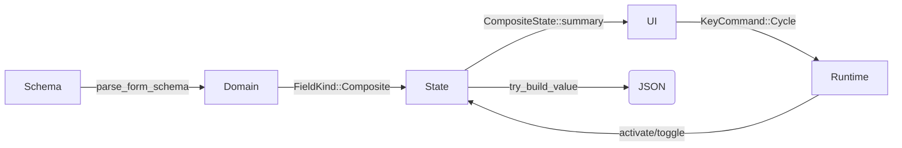

# SchemaUI OneOf/AnyOf 实施计划

> 目标：让 SchemaUI 在 TUI 中完整支持 JSON Schema 的 `oneOf`、`anyOf` 组合字段，覆盖从解析→状态管理→交互→序列化的全链路，并解决 CJK 光标宽度问题。

---

## 1. 架构概览

```
┌────────────┐      ┌─────────────┐      ┌───────────────┐      ┌───────────────┐
│ JSON Schema│ ──▶ │ Domain Layer│ ──▶ │ State Layer    │ ──▶ │ Presentation/UI │
└────────────┘      │ (parser.rs) │      │ (FormState)    │      │ (components.rs) │
                     └─────────────┘      └───────────────┘      └───────────────┘
                           │                      │                          │
                           ▼                      ▼                          ▼
                     CompositeField         CompositeState            输入/渲染逻辑
                           │                      │                          │
                           └──────────────▶ Runtime/App ◀────────────── Popup/Input
```

- **Domain Layer**：识别 `oneOf/anyOf`，生成 `FieldKind::Composite(CompositeField)`。
- **State Layer**：`FieldValue::Composite(CompositeState)` 懒加载子 `FormState`，负责激活/切换与 JSON 收集。
- **Presentation/UI**：渲染组合字段面板 + 子表单，使用 popup/快捷键切换或添加变体。
- **Runtime/Input**：监听 `KeyCommand`，调用 `CompositeState` API。

## 2. 模块设计

### 2.1 Domain（`src/domain/schema.rs` & `parser.rs`）
```rust
#[derive(Debug, Clone, PartialEq)]
pub enum FieldKind {
    String, Integer, Number, Boolean,
    Enum(Vec<String>), Array(Box<FieldKind>), Json,
    Composite(CompositeField),
}

#[derive(Debug, Clone, PartialEq)]
pub struct CompositeField {
    pub mode: CompositeMode,            // OneOf or AnyOf
    pub variants: Vec<CompositeVariant> // 原始 schema JSON + metadata
}
```
- `build_composite()` 负责遍历 `oneOf`/`anyOf` 数组，解析 `$ref` 并保留完整 schema JSON。
- 数组元素若包含组合 schema，则 `FieldKind::Array(Box::new(FieldKind::Composite))`。

### 2.2 State（`src/form/field.rs` & `form/state.rs`）
```rust
#[derive(Debug, Clone)]
pub enum FieldValue {
    Text(String), Bool(bool), Enum { .. }, MultiSelect { .. }, Array(String),
    Composite(CompositeState),
}

#[derive(Debug, Clone)]
pub struct CompositeState {
    mode: CompositeMode,
    variants: Vec<CompositeVariantState>,
}

pub struct CompositeVariantState {
    pub id: String,
    pub title: String,
    pub description: Option<String>,
    pub schema: Value,
    pub active: bool,
    pub form: Option<FormState>, // 懒加载
}
```
关键点：
1. **懒加载 FormState**：首次访问某个 variant 的表单时，根据 `schema` 动态调用 `FormState::from_schema` 生成子树。
2. **状态 API**：`activate_one_of(id)`、`toggle_any_of(id)`、`summary()`、`to_value()`。
3. **序列化**：
   - OneOf ⇒ 取 active variant 的 `FormState::try_build_value()`，并与 `type`/常量字段合并。
   - AnyOf ⇒ 对每个 active variant 执行同样逻辑，结果拼接成数组。

### 2.3 Presentation（`src/presentation/components.rs` & `view.rs`）
- **Header 区**：
  - OneOf：显示 `OneOf: [SQL|NoSQL]`，使用左右按键/Enter 触发 popup 单选。
  - AnyOf：显示 `AnyOf: [Email, SMS, Webhook] +`，`+` 调起多选 popup。
- **子表单渲染**：调用 `render_fields` 递归渲染 `variant.form`，并以缩进/边框区分。
- **CJK 光标**：使用 `unicode-width = 0.2.0` 计算宽度，确保边框/光标对齐。

### 2.4 Runtime/Input（`src/app/runtime.rs`, `input.rs`, `popup.rs`）
- `KeyCommand` 新增：`CycleOneOf`, `AddAnyOfVariant`, `RemoveAnyOfVariant` 等。
- `PopupState` 扩展：
  - OneOf：单选模式。
  - AnyOf：多选模式，`Space` 切换，`Enter` 应用。
- `App::handle_key` 调用 `CompositeState` API → 触发 `FormState` 更新。

## 3. 运作流程


1. **初始化**：解析 schema → 为组合字段生成 `CompositeState`（默认 OneOf 第一个 active）。
2. **用户操作**：
   - OneOf：`Enter` 打开单选 popup，选择后 `CompositeState::activate_one_of`，同时懒加载/重渲染子表单。
   - AnyOf：`Enter` 或 `Ctrl+A` 打开多选 popup，返回一组 active 变体，逐个懒加载子表单。
3. **渲染**：`render_fields` 根据 `CompositeState` 渲染 header + 子表单；CJK 文本按宽度 wrap，光标定位准确。
4. **保存**：`FormState::try_build_value` 会整合 active 变体的 JSON，生成与 schema 匹配的结构。

## 4. 实施步骤与里程碑

| 阶段 | 主要任务 | 产出 |
| ---- | -------- | ---- |
| A | 扩展 Domain（已完成） | `FieldKind::Composite`, parser 支持 oneOf/anyOf |
| B | 状态层实现 | `CompositeState` + 懒加载 `FormState`，`current_value` 输出真实 JSON |
| C | UI & 交互 | OneOf/AnyOf 选择面板 + 子表单渲染 + popup 扩展 |
| D | CJK 光标（已完成） | `unicode-width` 计算宽度，修复中文光标 |
| E | 回归/示例 | `src/main.rs` 示例跑通，输出 JSON 验证 |

## 5. 代码示例

### 5.1 解析组合字段
```rust
fn build_composite(
    context: &SchemaContext<'_>,
    mode: CompositeMode,
    schemas: &[Schema],
) -> Result<Option<CompositeField>> {
    if schemas.is_empty() { return Ok(None); }
    let variants = schemas.iter().enumerate().map(|(index, variant)| {
        let resolved = context.resolve_schema(variant)?;
        ensure_object_schema(&resolved)?;
        Ok(CompositeVariant {
            id: format!("variant_{}", index),
            title: resolved.metadata.and_then(|m| m.title.clone())
                        .unwrap_or_else(|| format!("Variant {}", index + 1)),
            description: resolved.metadata.and_then(|m| m.description.clone()),
            schema: serde_json::to_value(&Schema::Object(resolved))?,
        })
    }).collect::<Result<Vec<_>>>()?;
    Ok(Some(CompositeField { mode, variants }))
}
```

### 5.2 构建子 FormState
```rust
impl CompositeVariantState {
    fn ensure_form(&mut self) -> &mut FormState {
        if self.form.is_none() {
            self.form = Some(FormState::from_schema(&parse_form_schema(&self.schema).unwrap()));
        }
        self.form.as_mut().unwrap()
    }
}
```

### 5.3 序列化输出
```rust
match (&self.schema.kind, &self.value) {
    (FieldKind::Composite(_), FieldValue::Composite(state)) => {
        match state.mode {
            CompositeMode::OneOf => state.active_variant()
                .and_then(|variant| variant.ensure_form().try_build_value().ok()),
            CompositeMode::AnyOf => {
                let mut arr = Vec::new();
                for variant in state.active_variants() {
                    if let Ok(val) = variant.ensure_form().try_build_value() {
                        arr.push(val);
                    }
                }
                Ok(Some(Value::Array(arr)))
            }
        }
    }
    // ...
}
```

### 5.4 UI 渲染（伪代码）
```rust
fn render_composite(field: &FieldState, area: Rect, frame: &mut Frame<'_>) {
    match field.value {
        FieldValue::Composite(state) => {
            render_composite_header(state, area, frame);
            for variant in state.active_variants() {
                let child_area = next_block(area);
                render_fields(frame, child_area, variant.ensure_form(), true);
            }
        }
        _ => {}
    }
}
```

## 6. 风险与缓解

| 风险 | 影响 | 应对 |
| ---- | ---- | ---- |
| FormState 递归引用导致无限大小 | 编译失败 | 采用 `Option<Box<FormState>>` + 懒加载 |
| AnyOf 变体过多导致 UI 混乱 | 操作复杂 | 支持折叠/滚动、状态栏提示快捷键 |
| JSON 合并逻辑复杂（尤其中台 type 字段） | 序列化错误 | 在 Domain 层保存必要的常量字段，序列化时显式合并 |
| 性能 | 大 schema 渲染缓慢 | 只有 active 变体才创建/渲染 FormState |

## 7. 示例运作
- 用户选择 `dataStore` → OneOf → `SQL`：展示 `connection.driver/dsn` 等字段 → 保存后输出：
```json
"dataStore": {
  "type": "sql",
  "connection": { "driver": "postgres", ... }
}
```
- 用户在 `logging.outputs` 中添加 `console` + `file`：
```json
"outputs": [
  { "type": "console", "colored": true },
  { "type": "file", "path": "/var/log/app.log" }
]
```

## 8. 当前状态与下一步
- ✅ Domain parser & FieldValue 占位、CJK 光标
- ⏳ 下一步（需实现）：
  1. 在 `CompositeVariantState` 中真正挂载子 FormState 并输出 JSON。
  2. UI 组合控件（header + popup + 子表单）。
  3. 回归 `src/main.rs` 示例，确保全链路正确。

